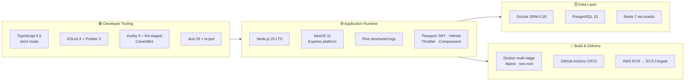

# DPay Enterprise NestJS Boilerplate


A production-ready, highly-scalable, modular, and cloud-native NestJS boilerplate built with TypeScript, PostgreSQL, and Drizzle ORM.

This repository serves as a baseline foundation for enterprise microservices, incorporating best practices around clean architecture, containerization, and AWS deployment.

---

## Tech Stack



### Core Framework & Runtime

| Technology                   | Version  | What it is & why it's here                                                                                                     | Where it's used                                                                     |
| ---------------------------- | -------- | ------------------------------------------------------------------------------------------------------------------------------ | ----------------------------------------------------------------------------------- |
| **NestJS**                   | `11.x`   | Progressive Node.js framework. Chosen for its DI container and module system, which keep features self-contained and testable. | [`src/app.module.ts`](src/app.module.ts), every `*.module.ts`                       |
| **@nestjs/platform-express** | `11.x`   | Express HTTP adapter. Provides the underlying server so Helmet/compression middleware work unchanged.                          | [`src/main.ts`](src/main.ts) via `NestFactory.create`                               |
| **TypeScript**               | `5.6`    | Typed superset of JS. `strict` mode catches null/undefined bugs at compile time instead of in production.                      | [`tsconfig.json`](tsconfig.json), all of [`src/`](src/)                             |
| **Node.js**                  | `20 LTS` | JavaScript runtime. LTS chosen for long-term security patches.                                                                 | [`Dockerfile`](Dockerfile) (`node:20-alpine`), [`ci.yml`](.github/workflows/ci.yml) |
| **RxJS**                     | `7.8`    | Reactive streams. Nest interceptors operate on observables, so it's required to transform responses.                           | [`src/common/interceptors/`](src/common/interceptors/)                              |
| **reflect-metadata**         | `0.2`    | Emits decorator metadata at runtime. Without it Nest's DI cannot resolve constructor types.                                    | Imported once at bootstrap; enabled by `emitDecoratorMetadata`                      |

### Database & Persistence

| Technology               | Version     | What it is & why it's here                                                                                                      | Where it's used                                                                                                         |
| ------------------------ | ----------- | ------------------------------------------------------------------------------------------------------------------------------- | ----------------------------------------------------------------------------------------------------------------------- |
| **Drizzle ORM**          | `0.39`      | Type-safe, SQL-first ORM. Picked over heavier ORMs for zero runtime overhead and fully inferred types straight from the schema. | [`src/database/database.provider.ts`](src/database/database.provider.ts), [`repositories/`](src/database/repositories/) |
| **drizzle-kit**          | `0.30`      | Migration toolkit. Generates SQL from schema diffs so migrations are reviewable in PRs.                                         | [`drizzle.config.ts`](drizzle.config.ts), `npm run db:generate`/`db:migrate`/`db:studio`                                |
| **PostgreSQL**           | `15-alpine` | Relational datastore. Alpine image keeps the local stack small.                                                                 | [`docker-compose.yml`](docker-compose.yml) → `db` service                                                               |
| **node-postgres (`pg`)** | `8.13`      | Postgres driver. Supplies the connection `Pool` that Drizzle wraps, with min/max sizing from config.                            | [`src/database/database.provider.ts`](src/database/database.provider.ts)                                                |

### Caching

| Technology  | Version    | What it is & why it's here                                                       | Where it's used                                                                                                                             |
| ----------- | ---------- | -------------------------------------------------------------------------------- | ------------------------------------------------------------------------------------------------------------------------------------------- |
| **Redis**   | `7-alpine` | In-memory store for caching and ephemeral state, keeping hot reads off Postgres. | [`docker-compose.yml`](docker-compose.yml) → `redis` service                                                                                |
| **ioredis** | `5.4`      | Redis client. Chosen for its reconnection handling and full command coverage.    | [`src/shared/cache/cache.service.ts`](src/shared/cache/cache.service.ts), [`redis.health.ts`](src/shared/health/indicators/redis.health.ts) |

### Security & Authentication

| Technology                  | Version       | What it is & why it's here                                                                         | Where it's used                                                                                                                  |
| --------------------------- | ------------- | -------------------------------------------------------------------------------------------------- | -------------------------------------------------------------------------------------------------------------------------------- |
| **@nestjs/jwt**             | `11.x`        | Signs and verifies JWTs. Registered async so secrets come from validated config, never hardcoded.  | [`src/shared/auth/auth.module.ts`](src/shared/auth/auth.module.ts)                                                               |
| **Passport + passport-jwt** | `0.7` / `4.0` | Bearer-token auth strategy. Standard, well-audited approach rather than hand-rolled token parsing. | [`src/shared/auth/jwt.strategy.ts`](src/shared/auth/jwt.strategy.ts), [`jwt-auth.guard.ts`](src/common/guards/jwt-auth.guard.ts) |
| **Helmet**                  | `8.x`         | Sets secure HTTP headers (HSTS, CSP, no-sniff) to close off common browser attack vectors.         | [`src/main.ts`](src/main.ts)                                                                                                     |
| **@nestjs/throttler**       | `6.x`         | Rate limiting. Bound globally as `APP_GUARD` so every route is protected by default.               | [`src/app.module.ts`](src/app.module.ts)                                                                                         |
| **compression**             | `1.7`         | gzip response compression, reducing payload size over the wire.                                    | [`src/main.ts`](src/main.ts)                                                                                                     |

### Observability & Health

| Technology           | Version | What it is & why it's here                                                                      | Where it's used                                                                      |
| -------------------- | ------- | ----------------------------------------------------------------------------------------------- | ------------------------------------------------------------------------------------ |
| **nestjs-pino**      | `4.1`   | Structured JSON logging. ~5x faster than Winston and parses natively in CloudWatch.             | [`src/app.module.ts`](src/app.module.ts), [`src/main.ts`](src/main.ts)               |
| **pino-http**        | `10.3`  | Serializes request/response pairs, with custom serializers trimming logs to useful fields only. | `LoggerModule.forRoot` in [`src/app.module.ts`](src/app.module.ts)                   |
| **pino-pretty**      | `13.x`  | Colorized human-readable logs. Deliberately **non-production only** — prod stays raw JSON.      | [`src/app.module.ts`](src/app.module.ts) transport branch                            |
| **uuid**             | `10.x`  | Generates correlation IDs so a single request can be traced across services.                    | [`correlation-id.middleware.ts`](src/common/middleware/correlation-id.middleware.ts) |
| **@nestjs/terminus** | `11.x`  | Health-check framework. Powers container orchestration liveness/readiness probes.               | [`src/shared/health/`](src/shared/health/)                                           |

### Validation & Configuration

| Technology            | Version | What it is & why it's here                                                                            | Where it's used                                                                                              |
| --------------------- | ------- | ----------------------------------------------------------------------------------------------------- | ------------------------------------------------------------------------------------------------------------ |
| **@nestjs/config**    | `4.x`   | Namespaced, injectable config. Keeps `process.env` out of business logic.                             | [`src/config/`](src/config/)                                                                                 |
| **Joi**               | `17.x`  | Env schema validation. Fails fast at boot on a missing/invalid variable rather than at first request. | [`src/config/validation.schema.ts`](src/config/validation.schema.ts)                                         |
| **class-validator**   | `0.14`  | Declarative DTO validation, enforced globally with `whitelist` + `forbidNonWhitelisted`.              | [`users/dto/`](src/modules/users/dto/), [`custom-validators.ts`](src/common/validation/custom-validators.ts) |
| **class-transformer** | `0.5`   | Converts plain payloads into typed class instances for the validation pipe.                           | `ValidationPipe` in [`src/main.ts`](src/main.ts)                                                             |
| **dotenv**            | `16.x`  | Loads `.env` for standalone scripts that boot outside the Nest context.                               | [`drizzle.config.ts`](drizzle.config.ts), [`seed/index.ts`](src/database/seed/index.ts)                      |

### API Documentation

| Technology          | Version | What it is & why it's here                                                                                       | Where it's used                                                                             |
| ------------------- | ------- | ---------------------------------------------------------------------------------------------------------------- | ------------------------------------------------------------------------------------------- |
| **@nestjs/swagger** | `11.x`  | Generates OpenAPI docs from decorators, so docs cannot drift from the code. Bearer auth persists across reloads. | [`src/main.ts`](src/main.ts); `@Api*` decorators in controllers/DTOs. Served at `/api/docs` |

### Testing

| Technology          | Version | What it is & why it's here                                                              | Where it's used                                                |
| ------------------- | ------- | --------------------------------------------------------------------------------------- | -------------------------------------------------------------- |
| **Jest**            | `29.x`  | Test runner. Config lives inline in `package.json` rather than a separate file.         | [`src/modules/users/__tests__/`](src/modules/users/__tests__/) |
| **ts-jest**         | `29.x`  | Runs TS tests without a prebuild, and mirrors the `@/*` aliases via `moduleNameMapper`. | `jest.transform` in [`package.json`](package.json)             |
| **@nestjs/testing** | `11.x`  | Builds a real DI container in tests so providers can be swapped for mocks.              | `*.spec.ts` files                                              |

### Code Quality & Git Hooks

| Technology            | Version | What it is & why it's here                                                                           | Where it's used                                  |
| --------------------- | ------- | ---------------------------------------------------------------------------------------------------- | ------------------------------------------------ |
| **ESLint**            | `8.57`  | Linter. Uses **type-aware** rules (`parserOptions.project`) to catch issues plain syntax rules miss. | [`.eslintrc.js`](.eslintrc.js) · `npm run lint`  |
| **typescript-eslint** | `8.x`   | TS parser + rules. Version-pinned via `overrides` so parser and plugin never drift apart.            | [`.eslintrc.js`](.eslintrc.js)                   |
| **Prettier**          | `3.3`   | Formatter. Runs through `eslint-plugin-prettier` so formatting shows up as lint errors.              | [`.prettierrc`](.prettierrc) · `npm run format`  |
| **Husky**             | `9.1`   | Git hook manager. Enforces quality gates locally instead of relying on CI alone.                     | [`.husky/`](.husky/)                             |
| **lint-staged**       | `15.2`  | Restricts lint/format to staged files to keep commits quick.                                         | [`lint-staged.config.js`](lint-staged.config.js) |
| **commitlint**        | `19.5`  | Validates Conventional Commits, keeping history machine-readable for changelogs.                     | [`commitlint.config.js`](commitlint.config.js)   |

### Build Tooling

| Technology         | Version | What it is & why it's here                                                                                                                           | Where it's used                                  |
| ------------------ | ------- | ---------------------------------------------------------------------------------------------------------------------------------------------------- | ------------------------------------------------ |
| **@nestjs/cli**    | `11.x`  | Wraps `tsc` for builds and watch-mode dev.                                                                                                           | `nest build` / `nest start`                      |
| **tsc-alias**      | `1.8`   | **Required**: `tsc` does _not_ rewrite `paths` aliases in emitted JS, so without this the built app crashes with `Cannot find module '@config/...'`. | `build` script in [`package.json`](package.json) |
| **tsconfig-paths** | `4.2`   | Resolves aliases at runtime for dev/watch mode and the seed runner.                                                                                  | `start:*` and `db:seed` scripts                  |
| **cross-env**      | `7.x`   | Sets env vars portably — bare `VAR=x` syntax fails on Windows shells.                                                                                | `start:*` scripts                                |
| **ts-node**        | `10.9`  | Executes TS directly, avoiding a build step for the seed script.                                                                                     | `db:seed` script                                 |

### Containerization & CI/CD

| Technology                | What it is & why it's here                                                                                                                      | Where it's used                            |
| ------------------------- | ----------------------------------------------------------------------------------------------------------------------------------------------- | ------------------------------------------ |
| **Docker**                | Multi-stage build. Compiles in a builder stage, then ships only prod deps on Alpine as a non-root user — smaller image, smaller attack surface. | [`Dockerfile`](Dockerfile)                 |
| **Docker Compose**        | One-command local stack. The app waits on `service_healthy` so it never boots before Postgres/Redis are ready.                                  | [`docker-compose.yml`](docker-compose.yml) |
| **GitHub Actions**        | CI: lint → type-check → test → build → Docker → ECR. CD: render ECS task definition → deploy → wait for stability.                              | [`.github/workflows/`](.github/workflows/) |
| **AWS ECR / ECS Fargate** | Image registry and serverless container hosting — no EC2 instances to patch.                                                                    | [`cd.yml`](.github/workflows/cd.yml)       |

---

## Project Configuration Files

Every configuration file in the repository, what it does, and why it exists:

### Build & Language

| File                                         | What it does                                                                    | Why it's needed                                                                                                                                           |
| -------------------------------------------- | ------------------------------------------------------------------------------- | --------------------------------------------------------------------------------------------------------------------------------------------------------- |
| [`package.json`](package.json)               | Dependencies, npm scripts, and inline Jest config.                              | Also carries an `overrides` pin keeping `@typescript-eslint/parser` locked to the plugin version — without it `npm ci` fails with an `ERESOLVE` conflict. |
| [`tsconfig.json`](tsconfig.json)             | Compiler options: `strict`, `ES2021`, decorators, and the `@/*` path-alias map. | Aliases keep imports readable (`@common/...` instead of `../../../common/...`).                                                                           |
| [`tsconfig.build.json`](tsconfig.build.json) | Extends the base config and excludes tests.                                     | Keeps `*.spec.ts` out of the shipped `dist/` output.                                                                                                      |
| [`nest-cli.json`](nest-cli.json)             | Nest CLI settings (`sourceRoot`, `deleteOutDir`).                               | Ensures each build starts from a clean `dist/`.                                                                                                           |
| [`drizzle.config.ts`](drizzle.config.ts)     | Schema path, migration output dir, and Postgres credentials.                    | Drives all `db:*` scripts; reads env via `dotenv` so it works outside Nest.                                                                               |

### Code Style & Git Hygiene (dotfiles)

| File                                             | What it does                                                                      | Why it's needed                                                                                                |
| ------------------------------------------------ | --------------------------------------------------------------------------------- | -------------------------------------------------------------------------------------------------------------- |
| [`.eslintrc.js`](.eslintrc.js)                   | Type-aware lint rules, naming conventions, `no-console` warnings.                 | Includes a `*.d.ts` override, since Express's `Request` augmentation can't obey the `I`-prefix interface rule. |
| [`.prettierrc`](.prettierrc)                     | Single quotes, trailing commas, 100-char width, 2-space indent, LF endings.       | One formatting source of truth, ending style debates in review.                                                |
| [`.editorconfig`](.editorconfig)                 | UTF-8, LF, 2-space indent, trim trailing whitespace, final newline.               | Applies to _any_ editor, including ones without Prettier installed.                                            |
| [`.gitignore`](.gitignore)                       | Excludes `node_modules/`, `dist/`, `.env`, `coverage/`, and AI-assistant dirs.    | Keeps secrets and build artifacts out of version control.                                                      |
| [`commitlint.config.js`](commitlint.config.js)   | Allowed commit types, subject casing, 100-char subject cap.                       | Enforces Conventional Commits for readable history and automated changelogs.                                   |
| [`lint-staged.config.js`](lint-staged.config.js) | `eslint --fix` + `prettier --write` on staged `.ts`; `prettier` on `.json`/`.md`. | Scopes work to staged files only, so commits stay fast.                                                        |
| [`.husky/pre-commit`](.husky/pre-commit)         | Runs `lint-staged`.                                                               | Blocks unformatted or lint-failing code from being committed.                                                  |
| [`.husky/commit-msg`](.husky/commit-msg)         | Runs `commitlint --edit`.                                                         | Rejects commit messages that break the convention.                                                             |
| `.husky/_/`                                      | Husky's generated hook shims.                                                     | Auto-created by `npm run prepare`; self-ignored via its own `.gitignore`.                                      |

### Containers & Deployment (dotfiles included)

| File                                                   | What it does                                                                                                                 | Why it's needed                                                        |
| ------------------------------------------------------ | ---------------------------------------------------------------------------------------------------------------------------- | ---------------------------------------------------------------------- |
| [`Dockerfile`](Dockerfile)                             | Two stages: builder compiles TS; runner installs prod deps only and switches to the non-root `node` user.                    | Smaller final image and no root process in production.                 |
| [`docker-compose.yml`](docker-compose.yml)             | Local `app` + `postgres:15-alpine` + `redis:7-alpine`, with `pg_isready` / `redis-cli ping` health checks and named volumes. | Reproducible local environment; volumes persist data between restarts. |
| [`.dockerignore`](.dockerignore)                       | Excludes `node_modules`, `dist`, `.git`, tests, docs, and env files (keeping `.env.example`).                                | Shrinks build context and prevents secrets leaking into image layers.  |
| [`.env.example`](.env.example)                         | Template for every variable the Joi schema expects.                                                                          | Committed as documentation — the real `.env` is gitignored.            |
| [`.github/workflows/ci.yml`](.github/workflows/ci.yml) | Lint → type-check → test → build, then Docker build/push to ECR on `main`.                                                   | Catches regressions before merge.                                      |
| [`.github/workflows/cd.yml`](.github/workflows/cd.yml) | Renders the ECS task definition with the new image and deploys, waiting for service stability.                               | Automated, rollback-aware production deploys.                          |

### Local-only directories (present but gitignored)

| Path                                   | What it is                                                                                                    |
| -------------------------------------- | ------------------------------------------------------------------------------------------------------------- |
| `.vscode/`                             | Workspace settings — format-on-save, ESLint auto-fix, workspace TypeScript SDK.                               |
| `.claude/` · `.agents/` · `.windsurf/` | AI-assistant configuration and cached skill docs. Ignored so tooling preferences never reach the shared repo. |

---

## Architecture Overview

This boilerplate follows **Clean Architecture** and **Domain-Driven Design (DDD)** principles:

- **Modular Design**: Code is grouped into self-contained feature modules (e.g. `src/modules/users`).
- **Data Access Layer**: Abstracted via Drizzle ORM & generic repositories (`BaseRepository`), completely separating DB queries from the service domain logic.
- **Observability**: Structured JSON logging using Pino, tracing request flow using Correlation IDs.
- **Twelve-Factor App Compliance**: Configurations are injected at runtime via environment variables verified by Joi schemas.

```
                  ┌─────────────────────────────────────┐
                  │          HTTP Request/Client        │
                  └──────────────────┬──────────────────┘
                                     │ (Correlation ID / Pino Logger Middleware)
                                     ▼
                  ┌─────────────────────────────────────┐
                  │             Controllers             │ (Routes, Swagger, DTOs)
                  └──────────────────┬──────────────────┘
                                     │ (Service Layer DI)
                                     ▼
                  ┌─────────────────────────────────────┐
                  │              Services               │ (Business Logic, Auth, Cache)
                  └──────────────────┬──────────────────┘
                                     │ (Repository Pattern)
                                     ▼
                  ┌─────────────────────────────────────┐
                  │            Repositories             │ (BaseRepository, Drizzle Schema)
                  └──────────────────┬──────────────────┘
                                     │ (Type-safe SQL query)
                                     ▼
                  ┌─────────────────────────────────────┐
                  │             PostgreSQL              │ (Drizzle ORM Engine)
                  └─────────────────────────────────────┘
```

---

## Folder Structure

```
src/
├── main.ts                        # Express bootstrapping & global configurations
├── app.module.ts                  # Application root configuration and middleware bindings
│
├── config/                        # Strongly typed configuration namespaces
│   ├── app.config.ts              # General app parameters (Port, prefix, etc.)
│   ├── database.config.ts         # Database connections pool metrics
│   ├── redis.config.ts            # Redis Cache parameters
│   └── validation.schema.ts       # Joi environment validation structure
│
├── database/                      # Connection layers & schemas
│   ├── schema/                    # Drizzle table schemas
│   │   └── users.schema.ts        # Users table schema
│   ├── repositories/              # Repository patterns wrapping queries
│   │   ├── base.repository.ts     # Generic abstract base repository
│   │   └── user.repository.ts     # Concrete user data accesses
│   ├── database.provider.ts       # Drizzle/pg connection pool factory
│   └── seed/                      # Mock data seeding
│
├── common/                        # Domain-agnostic cross-cutting concerns
│   ├── constants/                 # Roles, Permissions, Headers
│   ├── decorators/                # Custom Param decorators (CurrentUser, Roles)
│   ├── dto/                       # Generic/Common objects (PaginationQueryDto)
│   ├── exceptions/                # Domain validation errors (BusinessException)
│   ├── filters/                   # Unified exceptions catcher (GlobalExceptionFilter)
│   ├── guards/                    # Security guards (JWT, RBAC Roles, Permissions)
│   ├── interceptors/              # Response transform & execution logging
│   └── middleware/                # Correlation ID & raw logger middleware
│
├── modules/                       # Domain feature modules (containing controllers/services)
│   └── users/                     # Users domain module
│       ├── users.controller.ts    # Secured endpoints
│       └── users.service.ts       # Password hashing & business logic validations
│
└── shared/                        # Shared utility layers
    ├── auth/                      # JWT token validation strategies
    ├── cache/                     # Global Redis client adapter service
    ├── logger/                    # CloudWatch-compliant Pino logger wrapper
    └── health/                    # Readiness & Liveness Terminus health probes
```

---

## AWS Deployment Architecture

This application is designed to run in a containerized AWS environment using ECS Fargate:

1. **GitHub Actions CI/CD**: Automatic testing and compilation pipeline pushing standard Docker images to **Amazon ECR**.
2. **Application Load Balancer (ALB)**: Directs SSL traffic to dynamic **ECS Fargate** tasks.
3. **AWS ECS Fargate**: Serverless containers running NestJS instances.
4. **AWS Secrets Manager**: Key-values containing runtime credentials dynamically mounted to ECS task variables.
5. **IAM Roles**: Hardened Task Execution Roles managing ECR access and CloudWatch log outputs.
6. **CloudWatch**: Centralized log collection point streaming Pino JSON format logs.

---

## Local Development Setup

### Prerequisite Checklist

- **Node.js**: v20 or newer
- **Docker & Docker Compose**

### Installation

1. Clone the repository and navigate to its root:
   ```bash
   git clone <repository_url>
   cd dpay
   ```
2. Install npm packages:
   ```bash
   npm install
   ```
3. Copy env variables template:
   ```bash
   cp .env.example .env
   ```

### Start Infrastructure (Docker)

To run local PostgreSQL and Redis databases:

```bash
docker compose up -d db redis
```

### Database Migrations & Seeding

```bash
# Generate SQL migrations based on changes in src/database/schema/
npm run db:generate

# Execute migrations on the active database
npm run db:migrate

# Seed active database with initial mock users
npm run db:seed
```

### Start App

```bash
# Development mode
npm run start:dev

# Production mode
npm run build
npm run start:prod
```

Swagger API documentation will be available at `http://localhost:3000/api/docs`.

---

## Testing

```bash
# Run unit tests
npm run test

# Run tests with code coverage report
npm run test:cov
```

---

## Developer Quality Tools

We enforce styling and formatting using ESLint, Prettier, Husky, and Commitlint.

- **Check Styles**: `npm run lint`
- **TypeScript compiles verification**: `npm run type-check`
- **Conventional Commits**: Commit messages must adhere to conventional syntax: `<type>(<scope>): <subject>`. Run `npm run prepare` to wire Git hooks.
