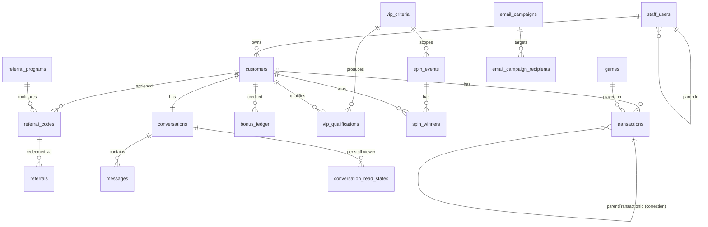

# Data Entry Management System — Backend Implementation Plan

NestJS 11 + Drizzle ORM (PostgreSQL) + Redis. Backend/API only.

> ## ✅ Delivered — all 11 phases merged to `main`
>
> This document is now a **record of what was built**, not a to-do list. 81
> of 82 tasks shipped; the exception is annotated in place rather than
> quietly ticked:
>
> - **10.6** async export jobs — deliberately skipped (Open Decision 12);
>   exports stream synchronously.
>
> **Where things stand:** 69 API paths, 19 tables, 9 migrations, 14 export
> definitions, 75 unit tests and 33 cross-tenant e2e tests.
> Architecture decisions live in [ARCHITECTURE.md](ARCHITECTURE.md); setup
> and day-to-day commands live in the [README](../README.md).
>
> The 14 items in [§7 Open Decisions](#7-open-decisions) are **implemented as
> defaults and still unconfirmed** — worth reviewing before a frontend
> depends on them.

> **Scope: single monolithic NestJS application.** One codebase, one database, one deployable, feature modules inside `src/modules/`. No microservices, no message bus between services, no separate worker deployment. Anything that would only pay off across multiple instances is deliberately left out (noted inline as _"defer"_).

---

## 0. Boilerplate Assessment

### Keep as-is

| Asset                                                                              | Notes                                                |
| ---------------------------------------------------------------------------------- | ---------------------------------------------------- |
| `src/config/*`, Joi `validation.schema.ts`                                         | Extend with new env vars                             |
| `src/database/database.provider.ts`, `drizzle.service.ts`, `transaction.helper.ts` | Solid foundation                                     |
| `src/common/filters`, `interceptors`, `middleware` (correlation id)                | Reuse verbatim                                       |
| `src/shared/logger`, `shared/health`, `shared/cache`                               | Reuse; extend cache with pattern-delete + `getOrSet` |
| `main.ts` bootstrap (helmet, compression, versioning, Swagger)                     | Extend Swagger with two bearer schemes               |

### Change

| Item                                                     | Reason                                                                                                                                                                                                                                                                                       |
| -------------------------------------------------------- | -------------------------------------------------------------------------------------------------------------------------------------------------------------------------------------------------------------------------------------------------------------------------------------------- |
| `src/database/schema/users.schema.ts`                    | **Replace** — split into `staff_users` + `customers` (two auth realms)                                                                                                                                                                                                                       |
| `src/modules/users/*`                                    | **Delete** — superseded by `staff` and `customers` modules                                                                                                                                                                                                                                   |
| `UserRole` enum in `app.constants.ts`                    | Replace `admin/user/manager` with `MASTER/MANAGER/STORE` + `CustomerStatus` etc.                                                                                                                                                                                                             |
| `BaseRepository.findPaginated()`                         | **Bug**: counts by fetching every row and reading `.length` ([base.repository.ts:168-176](../src/database/repositories/base.repository.ts#L168-L176)). Rewrite with `count()` aggregate. Also `searchColumn` accepts a single column only — needs multi-column OR search.                    |
| `IJwtPayload` / `ICurrentUser`                           | Add `realm: 'team' \| 'customer'`, `parentId`, drop `permissions` in favour of role+scope                                                                                                                                                                                                    |
| `ResponseTransformInterceptor` + `GlobalExceptionFilter` | **Both are written but never registered** — not in [main.ts](../src/main.ts) and not in [app.module.ts](../src/app.module.ts). Every response is currently raw and every error uses Nest's default shape. Must be wired as `APP_INTERCEPTOR` / `APP_FILTER`. See §1 _API response contract_. |
| `ApiResponseDto`                                         | `data` has no `@ApiProperty()`, so it never appears in Swagger; no `statusCode`; no generic support. Rewrite.                                                                                                                                                                                |
| `BusinessException`                                      | Emits `{success, message, error:'BusinessException'}` — a _different_ shape than the filter produces, and no stable machine-readable code. Rewrite around an error-code enum.                                                                                                                |
| `HashUtil`                                               | Add argon2id password hashing (currently sha256 only — not password-safe)                                                                                                                                                                                                                    |
| `RolesGuard`                                             | Keep, but add realm check + a `ScopeGuard` for row-level access                                                                                                                                                                                                                              |
| `src/queues/`                                            | **Delete** — no external queue in a single-instance monolith (see below)                                                                                                                                                                                                                     |
| `src/jobs/sample.job.ts`                                 | Replace with real `@Cron` jobs: VIP drift recompute, email dispatcher, spin-event status flips                                                                                                                                                                                               |

### Add (dependencies)

```
argon2                          password hashing
@nestjs/schedule                cron (VIP recompute, email batch dispatch, spin status flips)
@nestjs/event-emitter           in-process domain events (TransactionCreated → VIP/referral)
@nestjs/websockets
@nestjs/platform-socket.io
socket.io                       real-time messaging
nodemailer + @types/nodemailer  SMTP transport
handlebars                      email templating
nanoid                          referral code generation
date-fns                        date-range math
exceljs                         .xlsx export (streaming workbook writer)
```

**Deliberately not added** (single-instance monolith):

- `bullmq` / `@nestjs/bullmq` — background work is handled by `@nestjs/event-emitter` (fire-and-forget in-process) plus a `@Cron` dispatcher that drains pending rows from `email_campaign_recipients`. The DB table _is_ the queue, it survives restarts, and it's inspectable. Add BullMQ later only if you split out a worker process.
- `@socket.io/redis-adapter` — default in-memory adapter is correct for one instance. One-line swap if you ever run two.
- Redis stays for **caching + throttling + presence** only, exactly as the boilerplate already uses it.

---

## 1. Architecture & Conventions

### Two auth realms, one API

```
POST /api/v1/auth/team/login          → JWT { realm: 'team',     role: master|manager|store }
POST /api/v1/auth/customer/login      → JWT { realm: 'customer' }
```

- Separate JWT secrets **and** separate passport strategies (`jwt-team`, `jwt-customer`) so a customer token can never be replayed against a team route.
- `@TeamAuth(...roles)` and `@CustomerAuth()` composite decorators wrap `UseGuards + ApiBearerAuth + Roles`.
- Global `APP_GUARD` = team-JWT-by-default; `@Public()` opts out.

### Route namespaces

```
/api/v1/auth/*            both realms
/api/v1/team/*            staff-only (master, manager, store)
/api/v1/me/*              customer portal (read-mostly)
```

### The scoping engine — the single most important component

`ScopeService` returns a composable Drizzle `SQL` predicate, never a raw id list:

| Actor   | Customer visibility               | Extra filters allowed                                     |
| ------- | --------------------------------- | --------------------------------------------------------- |
| MASTER  | all                               | `managerId`, `storeId` (any)                              |
| MANAGER | `customers.manager_id = :actorId` | `storeId` — **validated to be a descendant of the actor** |
| STORE   | `customers.store_id = :actorId`   | none                                                      |

Rules:

1. **Every** list/detail/mutation query for customer-derived data (transactions, messages, VIP, referrals, spin winners, emails) composes this predicate. No exceptions.
2. `ResourceAccessGuard` re-checks on `:id` routes so a manager cannot `GET /team/customers/:id` for another manager's customer — returns **404, not 403** (no existence leak).
3. `staff_users.parentId` self-FK defines the chain. A manager may only create/read/update/deactivate stores where `parentId = self`.
4. Denormalized `customers.managerId` / `customers.storeId` are maintained by `CustomerAssignmentService` inside a transaction on create/reassign — never written ad-hoc.

### Layering

```
Controller (DTO validation, Swagger)
  → Service (business rules, uses ScopeService)
    → Repository (Drizzle queries, extends BaseRepository)
```

Cross-module reads go through the owning module's exported service, not raw repos.

### Final module layout (one app)

```
src/
  common/          guards, decorators, dto, filters, interceptors, pipes   (existing, extended)
  config/          (existing, extended)
  database/
    schema/        staff-users, customers, auth-sessions, games, transactions,
                   referral-*, bonus-ledger, vip-*, spin-*, conversations,
                   messages, conversation-read-states, email-*, audit-logs, settings
    repositories/  one per aggregate, all extending BaseRepository
    seed/
  shared/
    auth/          two passport strategies + guards
    scope/         ScopeService — the row-level access engine
    cache/  logger/  health/  mailer/  audit/
  modules/
    auth/          team + customer login gateways, refresh, logout
    staff/         master/manager/store management, hierarchy
    customers/     staff-side customer CRUD, lists, metrics
    games/
    transactions/  data entry + corrections
    vip/           criteria, qualification engine, VIP lists
    spins/         events, winners, recent-winners feed
    referrals/     programs, codes/links, bonus ledger
    messaging/     gateway + REST, conversations, read states
    dashboard/     scoped aggregate metrics
    emailing/      recipient filter engine, campaigns, dispatcher
    exports/       ExportService + one ExportDefinition per list
    portal/        customer-facing /me/* endpoints
  jobs/            @Cron tasks (VIP drift, email dispatch, spin status, export builder, file purge)
```

### API response contract

**Every** response — success, error, list — leaves the app in one envelope. No endpoint returns a bare object.

**Success (single resource)**

```jsonc
{
  "success": true,
  "statusCode": 200,
  "message": "Customer retrieved successfully",
  "data": { "id": "…", "fullName": "…" },
  "timestamp": "2026-07-31T10:12:33.284Z",
  "path": "/api/v1/team/customers/8f3c…",
  "correlationId": "0f9a-…",
}
```

**Success (list)** — adds `meta` and the optional per-list `summary`:

```jsonc
{
  "success": true,
  "statusCode": 200,
  "message": "Customers retrieved successfully",
  "data": [/* … */],
  "meta": {
    "total": 1240,
    "page": 1,
    "limit": 25,
    "totalPages": 50,
    "hasNextPage": true,
    "hasPreviousPage": false,
  },
  "summary": {
    "totalCustomers": 1240,
    "active": 812,
    "inactive": 428,
    "totalSpent": "482900.00",
    "totalWithdrawn": "301240.50",
  },
  "timestamp": "…",
  "path": "…",
  "correlationId": "…",
}
```

**Error (validation)** — `422`, one entry per failed constraint, nested paths dotted:

```jsonc
{
  "success": false,
  "statusCode": 422,
  "message": "Validation failed",
  "error": {
    "code": "VALIDATION_FAILED",
    "details": [
      { "field": "email", "constraint": "isEmail", "message": "email must be an email" },
      { "field": "amount", "constraint": "min", "message": "amount must not be less than 0.01" },
      {
        "field": "winners.0.customerId",
        "constraint": "isUuid",
        "message": "customerId must be a UUID",
      },
    ],
  },
  "timestamp": "…",
  "path": "…",
  "correlationId": "…",
}
```

**Error (business rule)** — stable machine code the frontend can switch on:

```jsonc
{
  "success": false,
  "statusCode": 409,
  "message": "This customer already holds an active code for the program",
  "error": { "code": "REFERRAL_CODE_ALREADY_ASSIGNED", "details": null },
  "timestamp": "…",
  "path": "…",
  "correlationId": "…",
}
```

**Error (unexpected)** — `500`. `message` is generic, the stack goes to the logs only, and `correlationId` is how support ties the two together:

```jsonc
{
  "success": false,
  "statusCode": 500,
  "message": "An unexpected error occurred",
  "error": { "code": "INTERNAL_ERROR", "details": null },
  "timestamp": "…",
  "path": "…",
  "correlationId": "0f9a-…",
}
```

Rules:

- `success` is strictly `statusCode < 400`. `data` is present only on success; `error` only on failure. Never both.
- `error.code` comes from a central `ErrorCode` enum — it is part of the API contract and must not be reworded once shipped. `message` is human-facing and _may_ change.
- `error.details` is `null`, or an array for validation, or an object for structured cases (e.g. bulk operations returning per-row failures).
- `correlationId` is echoed on every response and written into `audit_logs`.
- 5xx never leaks stack traces, SQL, or driver text to the client.

**Status code policy**

| Code | Used for                                                                         |
| ---- | -------------------------------------------------------------------------------- |
| 200  | successful read / update                                                         |
| 201  | resource created (`POST` creating a row)                                         |
| 204  | never — always return the envelope with `data: null`                             |
| 400  | malformed request, unparseable body/query, bad UUID in path                      |
| 401  | missing / expired / invalid token                                                |
| 403  | authenticated, correct realm, but role lacks the capability                      |
| 404  | not found **or** outside the actor's scope (deliberate — no existence leak)      |
| 409  | uniqueness / state conflict (duplicate email, duplicate spin winner, PG `23505`) |
| 422  | DTO validation failed, or a business rule rejected semantically valid input      |
| 429  | throttled                                                                        |
| 500  | unexpected                                                                       |

**Error code catalog** (`src/common/constants/error-codes.ts`) — grouped by domain, e.g.
`AUTH_INVALID_CREDENTIALS`, `AUTH_TOKEN_EXPIRED`, `AUTH_REFRESH_REUSED`, `AUTH_ACCOUNT_DISABLED`,
`SCOPE_FORBIDDEN`, `STAFF_INVALID_HIERARCHY`, `CUSTOMER_NOT_FOUND`, `CUSTOMER_EMAIL_TAKEN`,
`TX_AMOUNT_INVALID`, `TX_CORRECTION_EXCEEDS_PARENT`, `TX_ALREADY_REVERSED`,
`VIP_CRITERIA_INACTIVE`, `VIP_PERIOD_OVERLAP`, `SPIN_WINNER_NOT_VIP`, `SPIN_DUPLICATE_WINNER`,
`SPIN_PRESELECTED_REQUIRES_WINNERS`, `REFERRAL_CODE_ALREADY_ASSIGNED`, `REFERRAL_PROGRAM_EXPIRED`,
`EMAIL_NO_RECIPIENTS`, `EMAIL_CAMPAIGN_ALREADY_SENT`, `VALIDATION_FAILED`, `INTERNAL_ERROR`.

### Universal list contract

Every list endpoint accepts and returns the same shape:

```
?page=1&limit=25&search=&sortBy=&sortOrder=desc&<domain filters>
```

`summary` carries the per-list metric block (unread counts, totals, etc.) computed in a **second aggregate query over the same WHERE clause** — not by summing the current page.

### Universal export contract

Every list in the system has a matching `/export` sibling that produces a real `.xlsx`.

```
GET /api/v1/team/customers/export?<exact same query params as the list>&format=xlsx|csv
→ 200  Content-Type: application/vnd.openxmlformats-officedocument.spreadsheetml.sheet
       Content-Disposition: attachment; filename="customers_2026-07-31_1240-rows.xlsx"
```

Non-negotiable rules:

1. **The export endpoint reuses the list's filter DTO and the list's `ScopeService` predicate — the same code path, not a parallel one.** A store exporting customers gets exactly their own customers; a manager gets their chain. An export that can return a row the list wouldn't show is a data breach, so the query builder is shared by construction (`buildListQuery(filters, actor)` is called by both the list and the export).
2. **Exports bypass the response envelope.** A `@RawResponse()` decorator makes `ResponseTransformInterceptor` pass the stream through untouched — otherwise the interceptor would wrap the binary. Errors _before_ the stream opens still return the normal JSON error envelope.
3. **Every export is audit-logged** — actor, resource, filter snapshot, row count, timestamp. PII is leaving the system; that has to be reconstructable.
4. **Streaming, not buffering.** `exceljs`'s `WorkbookWriter` writes rows to the response as they arrive; rows are pulled from Postgres in batches (keyset paging on `id`), so a 200k-row export uses flat memory.
5. **Row cap + async fallback.** Synchronous streaming up to `EXPORT_SYNC_ROW_LIMIT` (default 50 000). Beyond that, the request returns `202` with an `exportJobId`, and a `@Cron` worker builds the file to `storage/exports/` and marks it ready — same durable-table-as-queue pattern as the email dispatcher. `GET /team/exports/:id` polls status, `GET /team/exports/:id/download` serves it. Files auto-purge after `EXPORT_RETENTION_HOURS` (default 48).

**Declarative column definitions.** Each exportable resource registers an `ExportDefinition`:

```ts
{
  key: 'customers',
  filename: (f) => `customers_${today()}`,
  sheetName: 'Customers',
  columns: [
    { header: 'Customer ID',    path: 'id',              width: 38 },
    { header: 'Full Name',      path: 'fullName',        width: 24 },
    { header: 'Email',          path: 'email',           width: 28 },
    { header: 'Status',         path: 'status',          format: 'enum' },
    { header: 'Manager',        path: 'manager.fullName' },
    { header: 'Store',         path: 'store.fullName' },
    { header: 'Total Spent',    path: 'totalSpent',      format: 'currency' },
    { header: 'Total Withdrawn',path: 'totalWithdrawn',  format: 'currency' },
    { header: 'Registered At',  path: 'registeredAt',    format: 'datetime' },
  ],
}
```

Formatting is centralised: `currency` → real Excel numbers with `'#,##0.00'` (never strings — the recipient must be able to `SUM()` the column), `datetime` → Excel date cells rendered in `EXPORT_TIMEZONE`, `enum` → human labels, booleans → `Yes`/`No`. Header row frozen, bold, auto-filter enabled, column widths set.

**Exportable lists** (each `/export` mirrors its list's filters exactly):

| Resource         | Endpoint                                      | Notable columns                                                                                  |
| ---------------- | --------------------------------------------- | ------------------------------------------------------------------------------------------------ |
| Customers        | `/team/customers/export`                      | owner chain, status, total transactions / spent / withdrawn / net, VIP tier, city, last activity |
| Transactions log | `/team/transactions/export`                   | customer, type, amount, game, correction parent, status, entered-by, occurred-at                 |
| VIPs             | `/team/vips/export`                           | customer, criteria, tier, threshold, achieved amount, qualified at, window active?               |
| Managers         | `/team/staff/export?role=manager`             | stores count, customers count, aggregate net                                                     |
| Stores           | `/team/staff/export?role=store`               | parent manager, customers count, aggregate net                                                   |
| Games            | `/team/games/export`                          | code, category, active, total debit/credit, transaction count                                    |
| Email log        | `/team/email/campaigns/export`                | subject, status, recipients, sent/failed, created by, sent at                                    |
| Email recipients | `/team/email/campaigns/:id/recipients/export` | customer, email, status, provider id, error, sent at                                             |
| Referrals        | `/team/referrals/export`                      | program, code, referrer, referee, status, reward, qualified/rewarded at                          |
| Spin events      | `/team/spin-events/export`                    | criteria, mode, status, scheduled at, winner count                                               |
| Spin winners     | `/team/spin-events/:id/winners/export`        | customer, prize, rank, preselected?, recorded by                                                 |
| Conversations    | `/team/conversations/export`                  | customer, assigned staff, messages, unread, last message at, responses today                     |
| Audit log        | `/team/audit-logs/export`                     | actor, action, entity, before/after, ip, correlation id — **master only**                        |
| VIP criteria     | `/team/vip-criteria/export`                   | tier, metric, threshold, period, active, qualified count                                         |

Adding a new list later means registering one `ExportDefinition` — the controller, streaming, scoping, auditing, and Swagger docs come from the shared `ExportService`.

### Swagger

Target: a frontend developer can build against `/api/docs` without asking a question, and can generate a typed client from the exported OpenAPI JSON.

- **Generic envelope in the schema.** A raw `ApiResponseDto<T>` erases `T` at runtime, so Swagger shows `data` as empty. Solved with `@ApiExtraModels` + `getSchemaPath` inside reusable decorators:
  - `@ApiOkData(CustomerDto)` → `200`, envelope with `data: CustomerDto`
  - `@ApiOkList(CustomerDto, CustomerListSummaryDto)` → `200`, envelope with `data: CustomerDto[]` + `meta` + `summary`
  - `@ApiCreatedData(TransactionDto)` → `201`
  - `@ApiErrors(401, 403, 404, 409, 422)` → attaches the documented error schema + a realistic example per code
  - `@ApiPaginatedQuery()` → documents page/limit/search/sortBy/sortOrder once
    These live in `src/common/swagger/` and every controller uses them — no hand-written `@ApiResponse` blocks.
- **Two security schemes**, `team-jwt` and `customer-jwt`, so "Authorize" in the UI reflects that a customer token cannot call team routes. `@TeamAuth()`/`@CustomerAuth()` attach the right one automatically.
- Every DTO property carries `@ApiProperty`/`@ApiPropertyOptional` with `description`, `example`, `enum`, and `format`. Money fields documented as `type: 'string', format: 'decimal'` with a note that they are `numeric(18,2)` serialized as strings.
- Filter DTOs are documented with their **enum values and semantics** — e.g. `spendingOperator: gt|gte|lt|lte|between|eq`, and what "active customer" means.
- Tags per module with descriptions; `operationId` set explicitly for clean client generation; `@ApiOperation({ summary, description })` on every route stating the required role and the scope rule applied.
- WebSocket events are documented in `docs/WEBSOCKET.md` (payload shape per event) — OpenAPI doesn't cover them.
- `npm run docs:openapi` writes `openapi.json` to disk for the frontend team; CI fails if it is stale.
- Swagger is served only when `SWAGGER_ENABLED=true`, and defaults to **false in production**.

---

## 2. Domain Model



### Table specs

**`staff_users`** — `id, email(uq), username(uq), passwordHash, firstName, lastName, role enum(master|manager|store), parentId FK→self, isActive, mustChangePassword, lastLoginAt, createdByStaffId, timestamps, deletedAt`
Indexes: `(role)`, `(parentId)`, `(email)`, partial `(isActive) WHERE deleted_at IS NULL`.
Constraint: `role='master' ⇒ parentId IS NULL`; `role='store' ⇒ parentId` references a manager. Enforced in service + a CHECK where expressible.

**`customers`** — `id, email(uq), username(uq), passwordHash, fullName, phone, city, state, country, ownerStaffId FK, managerId FK(nullable), storeId FK(nullable), status enum(active|inactive|suspended|banned), balance numeric(18,2), bonusBalance numeric(18,2), referredByCustomerId, registeredAt, lastLoginAt, lastActivityAt, notes, createdByStaffId, timestamps, deletedAt`
Indexes: `(managerId)`, `(storeId)`, `(status)`, `(city)`, `(lastActivityAt)`, `(email)`.
**Customers cannot mutate their own profile/credentials** — no write endpoints under `/me/*` except message send. All profile/password writes are staff endpoints, audit-logged.

**`auth_sessions`** — `id, subjectType enum(team|customer), subjectId, refreshTokenHash(uq), expiresAt, revokedAt, ip, userAgent, createdAt`. Enables refresh rotation, force-logout, and "kill sessions on deactivate".

**`games`** — `id, name, code(uq), category, isActive, timestamps`.

**`transactions`** — `id, customerId FK, type enum(debit|credit), amount numeric(18,2) CHECK > 0, gameId FK nullable, parentTransactionId FK→self nullable, status enum(pending|completed|reversed), channel, referenceNo, note, occurredAt timestamptz, enteredByStaffId FK, timestamps, deletedAt`
Indexes: `(customerId, occurredAt)`, `(type, occurredAt)`, `(gameId)`, `(parentTransactionId)`, partial `(customerId) WHERE type='credit' AND parent_transaction_id IS NULL`.

> **Semantics (locked in):**
>
> - `debit` = money **in** from the customer (deposit / spend).
> - `credit` = money **out** to the customer.
> - A `credit` **with** `parentTransactionId` is a _correction_ against an existing transaction, **not** a withdrawal.
> - `totalSpent` = `SUM(amount) WHERE type='debit'`
> - `totalWithdrawn` = `SUM(amount) WHERE type='credit' AND parent_transaction_id IS NULL`
> - `net / balance` = `SUM(debit) − SUM(credit)` ("in", "out", "balance")

**`referral_programs`** — `id, name, rewardType enum(fixed|percentage), referrerBonus numeric, refereeBonus numeric, minQualifyingDebit numeric, maxRewardsPerReferrer int, validFrom, validTo, isActive, createdByStaffId, timestamps`. **Master-only.**

**`referral_codes`** — `id, customerId FK, programId FK, code varchar(16) uq, linkSlug uq, isActive, usageCount, maxUses, expiresAt, assignedByStaffId, timestamps`. Master selects eligible customers (bulk assign) → codes + links generated.

**`referrals`** — `id, codeId, programId, referrerCustomerId, refereeCustomerId nullable, refereeEmail, status enum(pending|qualified|rewarded|rejected), rewardAmount, qualifiedAt, rewardedAt, sourceIp, landingUrl, createdAt`.

**`bonus_ledger`** — `id, customerId, referralId nullable, direction enum(credit|debit), amount, reason, createdByStaffId, createdAt`. Bonus money is kept **out of** `transactions` so dashboard net/game metrics stay clean.

**`vip_criteria`** — `id, name, tier int, metric enum(total_debit|net|transaction_count), thresholdAmount numeric, periodStart date, periodEnd date, isActive, createdByStaffId, timestamps`. **Master-only.** Multiple criteria may exist across different date ranges. "Currently active" ⇔ `isActive AND CURRENT_DATE BETWEEN periodStart AND periodEnd`.

**`vip_qualifications`** — `id, criteriaId FK, customerId FK, achievedAmount numeric, qualifiedAt, computedAt` — unique `(criteriaId, customerId)`. Materialized by the VIP engine so VIP lists and spin eligibility are index lookups, not scans.

**`spin_events`** — `id, name, description, vipCriteriaId FK, selectionMode enum(preselected|post_draw), scheduledAt timestamptz, status enum(scheduled|live|completed|cancelled), prizeDescription, prizePool numeric, createdByStaffId, timestamps`. The event's active window **is** the criteria's `periodStart..periodEnd`.

**`spin_winners`** — `id, spinEventId FK, customerId FK, prizeLabel, prizeAmount, rank int, isPreselected bool, announcedAt, recordedByStaffId, timestamps`. Unique `(spinEventId, customerId)`.

**`conversations`** — `id, customerId FK uq, assignedStaffId FK, status enum(open|closed|archived), lastMessageAt, lastMessagePreview, lastCustomerMessageAt, messageCount, timestamps`.

**`messages`** — `id, conversationId FK, senderType enum(customer|staff|system), senderStaffId nullable, senderCustomerId nullable, body text, attachments jsonb, deliveredAt, createdAt, deletedAt`. Index `(conversationId, createdAt DESC)`.
Internal attribution (which staff replied) is always recorded; exposing it to the customer is a frontend concern — the customer-facing serializer omits `senderStaffId`.

**`conversation_read_states`** — `id, conversationId FK, staffId FK, lastReadMessageId, lastReadAt` — unique `(conversationId, staffId)`. Unread is **per viewer**, because master/manager/store all see the same thread independently.

**`email_campaigns`** — `id, subject, bodyHtml, bodyText, status enum(draft|queued|sending|sent|failed|partial), filterSnapshot jsonb, recipientCount, sentCount, failedCount, scheduledAt, startedAt, completedAt, createdByStaffId, timestamps`.

**`email_campaign_recipients`** — `id, campaignId FK, customerId FK, email, status enum(pending|sent|failed|bounced), providerMessageId, error, sentAt`. Index `(campaignId, status)`.

**`audit_logs`** — `id, actorType, actorId, action, entityType, entityId, before jsonb, after jsonb, ip, userAgent, correlationId, createdAt`. Written by an interceptor on every non-GET team route. Non-negotiable for a data-entry system.

**`export_jobs`** — `id, resourceKey, format enum(xlsx|csv), filterSnapshot jsonb, status enum(pending|processing|ready|failed|expired), rowCount, filePath, fileSizeBytes, error, requestedByStaffId FK, expiresAt, startedAt, completedAt, createdAt`. Only used for exports above the sync row limit. Index `(status, createdAt)`.

**`system_settings`** — `id, key uq, value jsonb, updatedByStaffId, updatedAt`. Master-managed globals.

---

## 3. Phased Task List

### Phase 0 — Foundation rework (blocking; do first)

- [x] **0.1** Add dependencies listed in §0; update `.env.example` + `validation.schema.ts` (`JWT_CUSTOMER_SECRET`, `JWT_CUSTOMER_EXPIRES_IN`, `SMTP_*`, `MAIL_FROM`, `APP_PUBLIC_URL`, `REFERRAL_LINK_BASE_URL`, `EMAIL_BATCH_SIZE`, `ACTIVE_CUSTOMER_WINDOW_DAYS`, `HIGH_SPENDER_THRESHOLD`, `EXPORT_SYNC_ROW_LIMIT`, `EXPORT_RETENTION_HOURS`, `EXPORT_STORAGE_PATH`, `EXPORT_TIMEZONE`).
- [x] **0.2** Delete `src/modules/users/*` and `users.schema.ts`; rewrite `app.constants.ts` with `StaffRole`, `AuthRealm`, `CustomerStatus`, `TransactionType`, `SpinSelectionMode`, `VipMetric`, `CampaignStatus`.
- [x] **0.3** Fix `BaseRepository.findPaginated` — `count()` aggregate; add `searchColumns: SQL[]` (OR'd `ilike`); add `withCount(conditions)` helper. _Cursor pagination was left out of the base class: messaging is the only list that needs it and implements `before` itself, so a generic version would have had exactly one caller._
- [x] **0.4** `HashUtil` → argon2id (`hashPassword`, `verifyPassword`), keep `generateRandomToken`.
- [x] **0.5** Auth primitives: `JwtTeamStrategy`, `JwtCustomerStrategy`, `TeamJwtGuard`, `CustomerJwtGuard`, `@Public()`, `@TeamAuth(...roles)`, `@CustomerAuth()`, `@CurrentStaff()`, `@CurrentCustomer()`. Register team guard as `APP_GUARD`.
- [x] **0.6** `common/dto/date-range.dto.ts`, `common/dto/base-filter.dto.ts` (page/limit/search/sort/dateFrom/dateTo/lastNDays), `common/dto/id-list.dto.ts`.
- [x] **0.7** `AuditModule` + `AuditInterceptor` + `@Auditable(action, entityType)` decorator.
- [x] **0.8** **Response envelope** — rewrite `ApiResponseDto` (`success`, `statusCode`, `message`, `data`, `meta?`, `summary?`, `timestamp`, `path`, `correlationId`); rewrite `ResponseTransformInterceptor` to emit it and pick up `@ResponseMessage('…')` per route; **register it as `APP_INTERCEPTOR`** — it is currently dead code.
- [x] **0.9** **Error handling** — `error-codes.ts` enum; rewrite `BusinessException` to `(code, message, status, details?)` matching the filter's output exactly; add `ValidationException`; rewrite `GlobalExceptionFilter` to emit the `error: { code, details }` shape, map PG codes (`23505`→409, `23503`→400, `23514`→422, `22P02`→400), strip stack/SQL from 5xx, log full detail with `correlationId`; **register as `APP_FILTER`** — also currently dead code.
- [x] **0.10** **Validation format** — `ValidationPipe` `exceptionFactory` that flattens `class-validator` errors (including nested/array paths like `winners.0.customerId`) into `{ field, constraint, message }[]` and throws `ValidationException` (422). Fixes the current filter bug where an array `message` is cast to `string`.
- [x] **0.11** **Swagger kit** — `src/common/swagger/`: `@ApiOkData`, `@ApiOkList`, `@ApiCreatedData`, `@ApiErrors`, `@ApiPaginatedQuery` built on `@ApiExtraModels` + `getSchemaPath`; two bearer schemes (`team-jwt`, `customer-jwt`); tags per module; `npm run docs:openapi` export script. Default `SWAGGER_ENABLED=false` in production.
- [x] **0.12** Seed script: 1 master, 2 managers, 4 stores, ~40 customers, ~15 games, ~2k transactions, 3 VIP criteria, 2 spin events, conversations + messages. Makes every later phase testable immediately.
- [x] **0.13** Contract tests: assert the envelope shape on a success, a 422, a 404, a 409, and a 500 — so no later phase can silently break the format.

### Phase 1 — Identity, hierarchy, scoping

- [x] **1.1** `staff_users` + `customers` + `auth_sessions` schemas, relations, migration.
- [x] **1.2** `AuthModule`: `POST /auth/team/login`, `POST /auth/customer/login`, `POST /auth/refresh`, `POST /auth/logout`, `GET /auth/me`. Refresh-token rotation with reuse detection; revoke all sessions on staff/customer deactivation.
- [x] **1.3** Login throttling per identifier+IP (dedicated `ThrottlerGuard` config, stricter than global).
- [x] **1.4** **`ScopeService`** — `customerScope(actor)`, `staffScope(actor)`, `assertCanAccessCustomer()`, `assertCanManageStaff()`, `resolveDescendantIds()`. Unit-tested to death.
- [x] **1.5** `ResourceAccessGuard` (404-on-denied) + `@ScopedResource('customer')` decorator.
- [x] **1.6** `StaffModule` — CRUD for managers (master only) and stores (master or owning manager), `parentId` validation, reassign store→manager (cascades `customers.managerId` in a transaction), activate/deactivate.
- [x] **1.7** `CustomerAssignmentService` — assign/reassign customer owner, maintains denormalized `managerId`/`storeId` atomically.

### Phase 2 — Customers module

- [x] **2.1** Staff CRUD: create customer (owner = actor if store; else explicit), update profile, set/reset password, change status, soft delete. **All audit-logged.**
- [x] **2.2** `GET /team/customers` — scoped list. Filters: `status`, `isActive` (activity-based, see below), `managerId`, `storeId`, `city`, `country`, `hasTransactions`, `isVip`, `registeredFrom/To`, `lastActiveFrom/To`, `minSpent/maxSpent`, `search` (name/email/username/phone).
  - Per-row aggregates via a lateral join / grouped subquery: `totalTransactions`, `totalSpent`, `totalWithdrawn` (credit **without** parent), `netBalance`, `lastTransactionAt`.
  - `summary`: total customers, active, inactive, aggregate spent/withdrawn/net over the whole filtered set.
  - "Active customer" = `status='active' AND lastActivityAt >= now() - :activeWindowDays` (default 30, from `system_settings`).
- [x] **2.3** `GET /team/customers/:id` — full profile + lifetime metrics + VIP status + referral info + conversation summary.
- [x] **2.4** `GET /team/customers/:id/transactions`, `/messages`, `/referrals`, `/vip-history` — scoped sub-lists.
- [x] **2.5** Bulk actions: activate/deactivate, reassign owner. (Export is delivered centrally in Phase 10.)

### Phase 3 — Games & transactions (data entry core)

- [x] **3.1** `games` schema + master CRUD + list.
- [x] **3.2** `transactions` schema + migration.
- [x] **3.3** `POST /team/transactions` — data entry. Validates customer is in actor's scope, `amount > 0`, `occurredAt` not future-dated beyond tolerance. Updates `customers.balance` and `lastActivityAt` in the same DB transaction.
- [x] **3.4** **Correction flow** — `POST /team/transactions/:id/correction` creates a `credit` with `parentTransactionId = :id`, amount ≤ parent amount minus prior corrections, and marks the parent `reversed` if fully corrected. This is what keeps `totalWithdrawn` honest.
- [x] **3.5** `GET /team/transactions` — scoped list. Filters: `type`, `gameId`, `customerId`, `status`, `isCorrection`, `isWithdrawal`, `minAmount/maxAmount`, `dateFrom/dateTo`, `lastNDays`, `enteredByStaffId`, `managerId`, `storeId`. `summary`: count, total in, total out, net.
- [x] **3.6** Update/soft-delete transaction (master + manager only), fully audited with before/after.
- [x] **3.7** Emit `TransactionCreated` event → triggers VIP recompute for that customer + referral qualification check.

### Phase 4 — VIP engine

- [x] **4.1** `vip_criteria` + `vip_qualifications` schemas.
- [x] **4.2** Master CRUD for criteria. Validation: `periodEnd > periodStart`; warn on overlapping ranges within the same tier.
- [x] **4.3** **`VipQualificationService`**
  - `evaluateCustomer(customerId, criteriaId)` — sums the criteria's metric over `transactions.occurredAt ∈ [periodStart, periodEnd]` (debit only for `total_debit`, excluding corrections), upserts a `vip_qualifications` row when `>= thresholdAmount`.
  - `recomputeCriteria(criteriaId)` — set-based bulk upsert, one SQL statement (`INSERT … SELECT … ON CONFLICT DO UPDATE`).
  - Triggered: on `TransactionCreated` via `@OnEvent` (single customer, cheap), on criteria create/update (full recompute — one statement, run inline), and a nightly `@Cron` for drift repair.
- [x] **4.4** `GET /team/vips` — scoped list across **all** criteria/time frames. Filters: `criteriaId`, `tier`, `activeOnly` (criteria whose range contains today), `qualifiedFrom/To`, `managerId`, `storeId`, `search`. Returns customer + criteria + `achievedAmount` + `qualifiedAt` + whether the criteria window is currently active.
- [x] **4.5** `GET /team/vip-criteria/:id/eligible-customers` — feeds the spin-event preselected-winner picker.
- [x] **4.6** `GET /me/vip-status` — customer sees their current tier, achieved amount, threshold, and progress %, for the currently active criteria.

### Phase 5 — Spin events & winners

- [x] **5.1** `spin_events` + `spin_winners` schemas.
- [x] **5.2** `POST /team/spin-events` (master). Requires `vipCriteriaId` pointing to an **active** criteria. If `selectionMode = 'preselected'`, `winners[]` is **required at creation** and every entry must have a `vip_qualifications` row for that criteria — reject otherwise with a per-row error. If `post_draw`, winners are recorded later.
- [x] **5.3** `POST /team/spin-events/:id/winners` — post-draw data entry. Same VIP-eligibility validation. Blocks duplicate winners per event. Master-only (or master + manager — see Open Decisions).
- [x] **5.4** `GET /team/spin-events` — filters `status`, `selectionMode`, `criteriaId`, `dateFrom/To`, `search`. `GET /team/spin-events/:id` with winners.
- [x] **5.5** Cron: flip `scheduled → live → completed` based on `scheduledAt` and the criteria window.
- [x] **5.6** `GET /me/recent-winners` and `GET /team/recent-winners` — public-ish feed of recent spin winners (masked names, e.g. `Jo**n D.`), paginated, filter by event/date. Cached in Redis with short TTL.

### Phase 6 — Referral & bonus system

- [x] **6.1** `referral_programs`, `referral_codes`, `referrals`, `bonus_ledger` schemas.
- [x] **6.2** Master CRUD for programs (bonus amounts, reward type, validity, caps).
- [x] **6.3** `GET /team/referral-programs/:id/eligible-customers` + `POST /team/referral-programs/:id/assign` — master selects eligible customers (bulk), system generates unique `code` (nanoid, collision-retry) and `linkSlug`; returns full referral URL from `REFERRAL_LINK_BASE_URL`.
- [x] **6.4** `POST /auth/customer/login` and customer-creation accept `referralCode` → creates a `referrals` row (`pending`), links `customers.referredByCustomerId`. `GET /public/referral/:slug` resolves a link to its program metadata (rate-limited, `@Public()`).
- [x] **6.5** `ReferralRewardService` — on `TransactionCreated`, if the referee's cumulative qualifying debit ≥ `minQualifyingDebit` and the program is within validity and under `maxRewardsPerReferrer`, move the referral to `qualified` → write `bonus_ledger` credits for referrer and referee → `rewarded`. Idempotent (unique on `referralId` in the ledger).
- [x] **6.6** `GET /team/referrals` — scoped list, filters `programId`, `status`, `referrerCustomerId`, date range. `summary`: total referrals, qualified, rewarded, total bonus paid.
- [x] **6.7** `GET /me/referral` — customer's own code, link, referral count, bonus earned.

### Phase 7 — Real-time messaging

- [x] **7.1** `conversations`, `messages`, `conversation_read_states` schemas.
- [x] **7.2** `MessagingGateway` (Socket.IO, `/ws/messaging`) with JWT handshake auth for **both** realms. Default in-memory adapter — single instance.
  - Rooms: `conversation:{id}`, `staff:{staffId}`, `customer:{customerId}`, plus `role:master`.
  - Don't pre-join every conversation on connect. On a new message, the gateway resolves the owning store + its manager from the customer row and emits to `staff:{storeId}`, `staff:{managerId}`, `role:master`, and `customer:{customerId}`. Constant work per message regardless of chain size.
  - Events: `message:new`, `message:read`, `typing`, `conversation:updated`, `unread:count`.
- [x] **7.3** REST parity for every WS action (mobile/retry friendly): `POST /team/conversations/:id/messages`, `POST /me/messages`, `POST /team/conversations/:id/read`.
- [x] **7.4** `GET /team/conversations` — **scoped inbox**. Master sees all + filters by `managerId`/`storeId`; manager sees own chain + filters by `storeId`; store sees own customers only.
  - Filters: `unreadOnly`, `todayOnly`, `activeCustomersOnly`, `status`, `assignedStaffId`, `hasUnreplied`, `dateFrom/To`, `search` (customer name/email/message body).
  - `summary` (over the full filtered set, not the page): `totalConversations`, `totalUnreadMessages`, `responsesToday`, `newConversationsToday`, `awaitingReply`.
  - Unread is computed per viewing staff from `conversation_read_states`.
- [x] **7.5** `GET /team/conversations/:id/messages` — cursor-paginated (`before`/`after` message id), scope-guarded. Marks read for the viewer.
- [x] **7.6** `GET /me/messages` + `GET /me/messages/unread-count` — customer thread; serializer strips internal staff attribution.
- [x] **7.7** Redis-backed presence + typing indicators; message rate-limit per customer.

### Phase 8 — Dashboard & analytics

- [x] **8.1** `GET /team/dashboard` — scope-aware, all metrics constrained by `ScopeService`:
  - **All-time net**: `totalIn` (Σ debit), `totalOut` (Σ credit), `balance` (in − out).
  - **This month net**: same three, `occurredAt` within current month; plus `%` delta vs previous month.
  - **Top game by debit** and **top game by credit** (configurable `topN`, default 5), with amount + transaction count.
  - Customer counts: total / active / inactive / new this month.
  - VIP counts: currently-active VIPs, by tier.
  - Messaging: unread total, conversations today, responses today.
  - Team: for master → per-manager rollup; for manager → per-store rollup; for store → own totals only.
  - Optional `dateFrom/dateTo` + `granularity=day|week|month` for the trend series.
- [x] **8.2** `GET /team/dashboard/trends` — time-bucketed net series via `date_trunc`, gap-filled with `generate_series`.
- [x] **8.3** `GET /me/dashboard` — customer's own balance, bonus balance, VIP status/progress, recent transactions, recent winners, unread messages.
- [x] **8.4** Cache dashboard payloads in Redis (60–120 s TTL) keyed by `actorId + filter hash`; invalidate on `TransactionCreated`.

### Phase 9 — Email system

- [x] **9.1** `email_campaigns` + `email_campaign_recipients` schemas; `MailerService` (nodemailer SMTP, handlebars templates, retry/backoff).
- [x] **9.2** **`RecipientFilterService`** — turns a filter DTO into a scoped customer query. Supported filters:
  - Quick filters: `allActiveCustomers`, `withTransactions`, `withoutTransactions`, `recentTransactions` (30 d), `highSpenders` (≥ threshold), `lowSpenders` (< threshold). Thresholds configurable (default $250) via `system_settings`.
  - `dateRange`: `lastNDays` | `startDate` + `endDate`.
  - `spending`: `operator ∈ {gt, gte, lt, lte, between, eq}` + `minAmount` / `maxAmount`, applied to `totalSpent`.
  - Location: `city`, `state`, `country`.
  - Ownership: `managerId`, `storeId` (master/manager only, scope-validated).
  - VIP: `isVip`, `vipTier`.
  - `customerIds[]` — explicit selection, **intersected with** the actor's scope.
  - Always excludes customers with no email, `emailOptOut`, or hard-bounced addresses.
- [x] **9.3** `POST /team/email/recipients/preview` — returns count + first N recipients for the given filter, **before** composing. Critical UX safety net.
- [x] **9.4** `POST /team/email/campaigns` (draft) → `POST /team/email/campaigns/:id/send` → resolves recipients, snapshots them into `email_campaign_recipients` with `status='pending'`, sets campaign `queued`, returns immediately.
  - **`EmailDispatcherService`** — a `@Cron('*/30 * * * * *')` that claims a batch of `pending` rows (`UPDATE … SET status='sending' … WHERE id IN (SELECT … FOR UPDATE SKIP LOCKED) RETURNING *`), sends via `MailerService`, writes `sent`/`failed` + `providerMessageId`/`error`, retries failures up to N times, then rolls the campaign status up to `sent`/`partial`/`failed`.
  - The recipients table is the durable queue: restart-safe, inspectable in SQL, no extra infra. `SKIP LOCKED` means this still behaves correctly if you ever run a second instance.
- [x] **9.5** `GET /team/email/campaigns` (list + filters by status/date/creator) and `GET /team/email/campaigns/:id` (with per-recipient results + delivery stats).
- [x] **9.6** Scheduled sends (`scheduledAt` picked up by the same cron), send-rate throttling via `EMAIL_BATCH_SIZE`, `POST /:id/cancel` (deletes remaining `pending` rows), unsubscribe token endpoint (`@Public()`).

### Phase 10 — Excel exports

Built last on purpose: every list's filters and scoping must already exist, so exports are a thin, uniform layer over them rather than 14 bespoke queries.

- [x] **10.1** Refactor each list service to expose `buildListQuery(filters, actor)` returning a `$dynamic()` Drizzle query, so the list and its export share one query builder. This is the step that guarantees an export can never out-scope its list.
- [x] **10.2** `ExportModule`: `ExportDefinition` interface + registry, `ExportService` (batch-fetch by keyset, map rows through column definitions), `ExcelWriter` (`exceljs` `WorkbookWriter` streaming to the response — frozen bold header, auto-filter, widths, `#,##0.00` money cells, timezone-correct date cells), `CsvWriter`.
- [x] **10.3** `@RawResponse()` decorator + `ResponseTransformInterceptor` bypass, so binary streams aren't wrapped in the JSON envelope. Errors raised before the stream opens still return the standard error envelope.
- [x] **10.4** Generic `@ExportEndpoint(definitionKey)` controller mixin producing `GET /<resource>/export` with the resource's own filter DTO, correct `Content-Disposition`, and Swagger `@ApiProduces` + binary response schema.
- [x] **10.5** Register the `ExportDefinition`s from §1. **14 shipped**: managers and stores are one role-filtered `staff` export rather than two, and `referral-programs` was added. `spin-winners`, `email-recipients` and `audit-logs` came later — the first two needed a staff-facing list to delegate to, and the audit trail had no read path at all until then.
- [ ] **10.6** `export_jobs` schema + async path: `202 + exportJobId` above `EXPORT_SYNC_ROW_LIMIT`, `@Cron` builder, `GET /team/exports/:id` status, `GET /team/exports/:id/download` (scope-checked — only the requester or a master), retention purge job. **Deliberately skipped** per Open Decision 12 — exports stream synchronously and every real list is far below the sync limit. Build this when an export first exceeds `EXPORT_SYNC_ROW_LIMIT`.
- [x] **10.7** Audit every export (actor, resource, filter snapshot, row count); throttle exports per staff member; **tests asserting a store's export contains only their customers and a manager's excludes sibling chains.**

### Phase 11 — Hardening & delivery

- [x] **11.1** Unit tests: `ScopeService` (exhaustive role × resource matrix), `VipQualificationService`, `RecipientFilterService`, transaction-correction math, withdrawal calculation.
- [x] **11.2** E2E tests per module with three staff personas + one customer, asserting **cross-tenant denial** on every endpoint (manager A cannot touch manager B's data; store cannot touch a sibling store's) — lists _and_ exports.
- [x] **11.3** Index review + `EXPLAIN ANALYZE` on the customer list, conversation inbox, dashboard, and largest export against seeded volume (≥ 100k transactions).
- [x] **11.4** Rate limiting per route group; payload size limits; strict CORS; secrets checklist.
- [x] **11.5** Swagger audit: every route has `@ApiOperation` (summary + required role + scope rule), every DTO field has an example, every error code appears in at least one documented response. Regenerate and hand off `openapi.json`.
- [x] **11.6** Docker Compose (postgres + redis + api — three containers, one app image), CI (lint, type-check, test, build), migrations run on deploy.
- [x] **11.7** `docs/` — API guide, role-permission matrix, transaction-semantics doc (in/out/correction), WebSocket event reference, runbook.

---

## 4. Role → Capability Matrix

| Capability                             |  Master   |    Manager     |       Store        |    Customer     |
| -------------------------------------- | :-------: | :------------: | :----------------: | :-------------: |
| Create/manage managers                 |    ✅     |       ❌       |         ❌         |       ❌        |
| Create/manage stores                   |    ✅     |    ✅ (own)    |         ❌         |       ❌        |
| Create/manage customers                |    ✅     | ✅ (own chain) |      ✅ (own)      |       ❌        |
| Reset customer password / edit profile |    ✅     | ✅ (own chain) |      ✅ (own)      |       ❌        |
| Enter transactions                     |    ✅     | ✅ (own chain) |      ✅ (own)      |       ❌        |
| Edit / correct transactions            |    ✅     | ✅ (own chain) | ➖ correction only |       ❌        |
| VIP criteria CRUD                      |    ✅     |       ❌       |         ❌         |       ❌        |
| View VIP lists                         |  ✅ all   |  ✅ own chain  |       ✅ own       |  ➖ own status  |
| Spin events CRUD + winners             |    ✅     |       ❌       |         ❌         | ➖ view winners |
| Referral programs / bonus setup        |    ✅     |       ❌       |         ❌         |   ➖ own code   |
| Assign referral codes                  |    ✅     |       ❌       |         ❌         |       ❌        |
| Messaging                              |  ✅ all   |  ✅ own chain  |       ✅ own       |  ✅ own thread  |
| Dashboard                              | ✅ global |  ✅ own chain  |       ✅ own       |   ➖ personal   |
| Email campaigns                        |    ✅     | ✅ (own chain) |         ❌         |       ❌        |
| Audit log                              |    ✅     |  ➖ own chain  |         ❌         |       ❌        |

Legend: ✅ full · ➖ limited · ❌ none

---

## 5. Key Formulas (single source of truth)

```sql
-- Per-customer metrics (used by customer list, detail, dashboard, email filters)
total_transactions = COUNT(*)                              WHERE deleted_at IS NULL
total_spent        = SUM(amount) FILTER (WHERE type='debit')
total_withdrawn    = SUM(amount) FILTER (WHERE type='credit' AND parent_transaction_id IS NULL)
total_corrections  = SUM(amount) FILTER (WHERE type='credit' AND parent_transaction_id IS NOT NULL)
net_balance        = SUM(amount) FILTER (WHERE type='debit') - SUM(amount) FILTER (WHERE type='credit')

-- Dashboard
all_time_in  = SUM(amount) WHERE type='debit'
all_time_out = SUM(amount) WHERE type='credit'
all_time_net = all_time_in - all_time_out
top_game_debit  = SUM(amount) WHERE type='debit'  GROUP BY game_id ORDER BY 1 DESC LIMIT :n
top_game_credit = SUM(amount) WHERE type='credit' GROUP BY game_id ORDER BY 1 DESC LIMIT :n

-- VIP qualification (metric='total_debit')
achieved = SUM(t.amount) WHERE t.type='debit'
       AND t.occurred_at BETWEEN c.period_start AND c.period_end
       AND t.deleted_at IS NULL
qualified ⇔ achieved >= c.threshold_amount
criteria_active ⇔ c.is_active AND CURRENT_DATE BETWEEN c.period_start AND c.period_end

-- Spin eligibility
eligible ⇔ EXISTS (vip_qualifications WHERE criteria_id = event.vip_criteria_id AND customer_id = :id)

-- Messaging unread (per viewing staff)
unread = COUNT(m.*) WHERE m.conversation_id = :c
     AND m.sender_type = 'customer'
     AND m.created_at > COALESCE(rs.last_read_at, '-infinity')
responses_today = COUNT(m.*) WHERE m.sender_type='staff' AND m.created_at::date = CURRENT_DATE
```

All money columns are `numeric(18,2)`. Never `float`. Serialize as strings in JSON to avoid JS precision loss.

---

## 6. Non-Functional Requirements

- **Security** — argon2id passwords; short-lived access tokens (15 m) + rotating refresh (7 d) with reuse detection; separate secrets per realm; row-level scoping enforced in the data layer, not the controller; 404-not-403 on cross-tenant access; every mutation audit-logged; PII excluded from logs (pino redaction on `password`, `token`, `authorization`).
- **Performance** — indexes per §2; aggregates via lateral joins, never N+1; cursor pagination for messages; Redis caching on dashboard + recent-winners; materialized `vip_qualifications` instead of on-the-fly scans; exports stream in keyset batches so memory stays flat regardless of row count.
- **Consistency** — every multi-write operation wrapped in `transaction.helper.ts`; idempotency keys on transaction entry and campaign send.
- **Observability** — correlation id propagated to logs, audit rows, and WS frames; `/health` extended with SMTP + email-backlog checks; structured error codes (`BusinessException` with a stable `code`).
- **Scaling escape hatches** (not built now, but nothing blocks them): swap the Socket.IO adapter for `@socket.io/redis-adapter`; move `EmailDispatcherService` into a separate process (the `SKIP LOCKED` claim already makes it safe); introduce BullMQ if job types multiply.
- **Testing target** — ≥ 80 % coverage on services; 100 % on `ScopeService`.

---

## 7. Open Decisions

Defaults are assumed and implemented unless you say otherwise:

1. **Real-time transport** — assumed **Socket.IO**, in-memory adapter, single instance. (Alternative: SSE — simpler, one-way only, would still need REST for sending.)
2. **Email provider** — assumed **SMTP via nodemailer**, behind a `MailProvider` interface so SendGrid/SES/Resend can be swapped in later.
3. **Can a manager create spin events / referral programs?** — assumed **no, master-only** per spec §5.2/§6.6. Managers get read access.
4. **Can a manager own customers directly**, or must every customer sit under a store? — assumed **yes, managers can own directly** (`storeId` nullable).
5. **Bonus vs. real balance** — assumed **separate ledgers** (`bonus_ledger` vs `transactions`) so referral bonuses don't distort dashboard net/game metrics.
6. **Customer self-registration** — assumed **none**; customers are created by staff. Referral links produce a _lead_ that staff converts. (If public signup via referral link is wanted, that's an extra `@Public()` endpoint in Phase 6.)
7. **"Active customer" window** — assumed **30 days** of `lastActivityAt`, configurable in `system_settings`.
8. **High/low spender threshold** — assumed **$250** per spec, configurable.
9. **Multi-currency** — assumed **single currency**. Adding it later means a `currency` column on transactions and per-currency aggregates.
10. **Validation status code** — assumed **422** for DTO/business validation failures, **400** reserved for malformed requests. Flip to 400-for-everything if your frontend expects that; it's one constant.
11. **204 No Content** — assumed **never used**; deletes return `200` with `data: null` so the envelope is universal and the client parser has no special case.
12. **Export delivery** — assumed **synchronous streamed download up to 50 000 rows**, async job + download link beyond. If exports are always small in practice, the async path (and `export_jobs`) can be dropped from Phase 10 to save ~a day.
13. **Export timezone** — assumed a single configured `EXPORT_TIMEZONE` for all date cells, since Excel has no timezone concept. If staff span regions, the alternative is exporting UTC and labelling the column.
14. **Export file storage** — assumed **local disk** (`storage/exports/`) with a retention purge, consistent with a single-instance monolith. S3 becomes necessary only if you run more than one instance.

---

## 8. Suggested Sequence

```
Phase 0 ─→ Phase 1 ─┬─→ Phase 2 ─→ Phase 3 ─┬─→ Phase 4 ─→ Phase 5 ─┐
                    │                        ├─→ Phase 6 ───────────┤
                    └─→ Phase 7 ─────────────┤                      ├─→ Phase 10 ─→ Phase 11
                                             └─→ Phase 8 ─→ Phase 9 ┘
```

Phases 0–3 are strictly sequential and carry the most risk (scoping + transaction semantics). Phases 4/6/7 can run in parallel once Phase 3 lands. Phase 8 needs Phase 3–4; Phase 9 needs Phase 2–3. **Phase 10 (exports) depends on all list endpoints existing**, so it comes last but before hardening.
